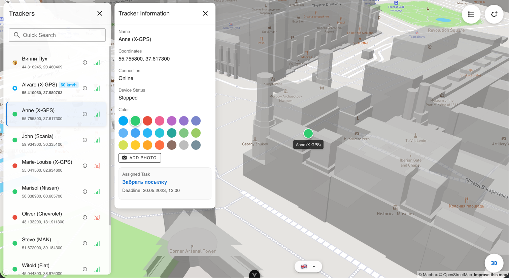
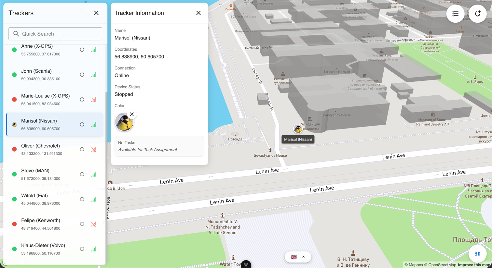
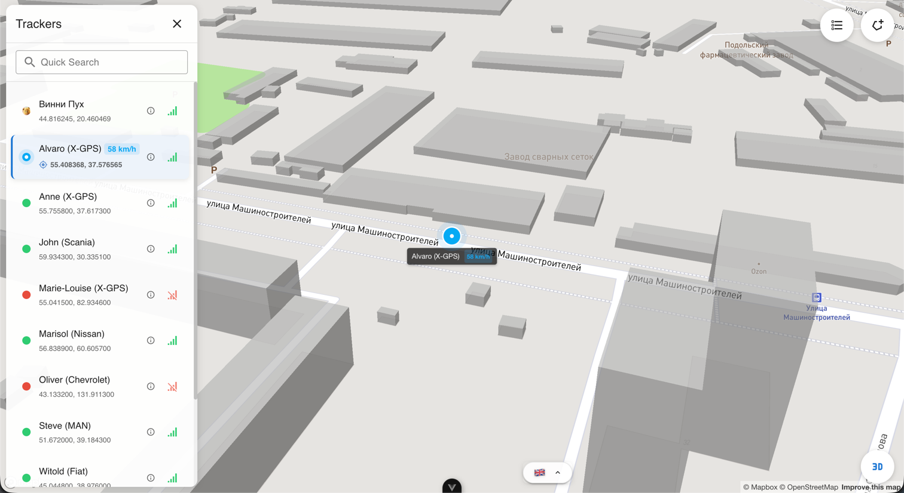
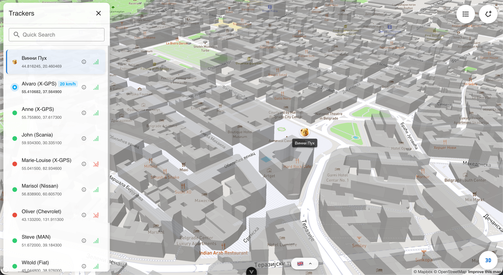
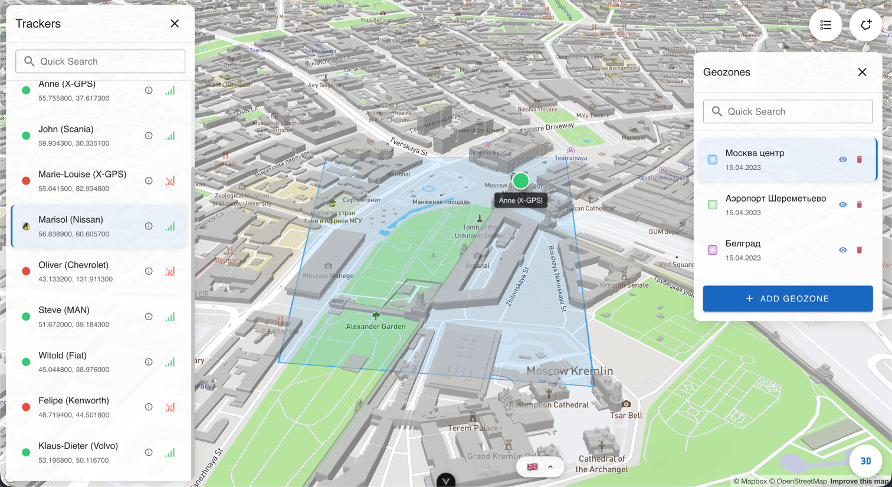
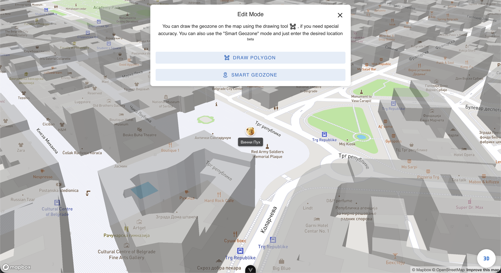

# mini-navixy

This project is a real-time GPS beacon and tracker monitoring dashboard built with Vue 3, TypeScript, and Mapbox GL. It represents an implementation designed to showcase how location tracking, geofencing, and task dispatching can be integrated into an interactive web interface.

## Screenshots

| 1. Tracker Information & Color Customization | 2. Avatar/Photo Uploads for Markers |
| :---: | :---: |
|  |  |

| 3. Live Simulated Tracker Movement | 4. 3D Perspective Map Views |
| :---: | :---: |
|  |  |

| 5. Interactive Geozone Listing | 6. Geofence Creation Modes |
| :---: | :---: |
|  |  |

---

## Core Features

### 1. Tracker Monitoring
*   **Real-Time Status & Simulators:** Displays trackers on the map showing their connection status (*Online*, *Offline*) and operational state (*Moving*, *Stopped*).
*   **Active Route Simulation:** Features a live simulated tracker (`Alvaro`) that realistically traverses pre-recorded coordinates on the map while computing dynamic velocity values.
*   **GPS Follow Mode:** Lock and auto-center the camera viewport on active moving trackers.
*   **Marker Customization:** Personalize map markers by selecting unique color codings or uploading image files to act as custom marker avatars.

### 2. Geofence Management
*   **Manual Polygon Drawing:** Create geofences by drawing custom polygon shapes directly on the map via native Mapbox Draw utilities.
*   **Smart Geozone Geocoding:** Automatically define rectangular geofences centered on searched cities or locations.
*   **Visibility Controls:** Easily show, hide, center, or delete active geozones from a unified list panel.

### 3. Task Management & Validation
*   **Dispatch System:** Assign tasks to specific trackers with parameters like descriptions, comments, destination addresses, and deadlines.
*   **Geofence Boundary Validation:** Utilizing a ray-casting (point-in-polygon) algorithm, the task system automatically checks whether the entered target address coordinates fall within the assigned geozone boundaries.
*   **Conflict Prevention:** Tracks mandatory tasks to prevent overloading individual tracking units with conflicting schedules.

### 4. UI/UX & Localization
*   **Interactive 3D Views:** Toggle 3D perspective maps with extruded buildings and smooth pitch adjustments.
*   **Multilingual Support (i18n):** Complete language toggle between English and Russian locales.
*   **Animated Text Scramble Translation:** Task detail values can be dynamically translated via simulated integration using a retro GSAP scramble-animation effect.

---

## Technical Stack

*   **Framework:** Vue 3 (Composition API, Setup Sugar)
*   **State Management:** Pinia
*   **Language:** TypeScript
*   **Map Engine:** Mapbox GL JS (with Mapbox Draw & Mapbox Geocoder plugins)
*   **UI Components:** Vuetify 3
*   **Animations:** GSAP (GreenSock Animation Platform)
*   **Bundler:** Vite
*   **Localization:** Vue-i18n

---

## Project Setup

### Prerequisites

To communicate with Mapbox services, you need to create an API token and add it to your environment files.

1. Create a `.env` file in the root directory (refer to `.env.example`).
2. Add your token:
   ```env
   VITE_MAPBOX_API_KEY=your_mapbox_public_api_token_here
   ```

### Installation

Install dependencies:
```bash
npm install
```

### Run Local Development Server

Start Vite's local dev server with hot reload:
```bash
npm run dev
```

### Production Compiling and Minification

Compile the application for deployment:
```bash
npm run build
```

The compiled output will be generated inside the `dist/` folder.

### Quality Assurance

To run the unit tests (Vitest):
```bash
npm run test:unit
```

To run the linter rules:
```bash
npm run lint
```